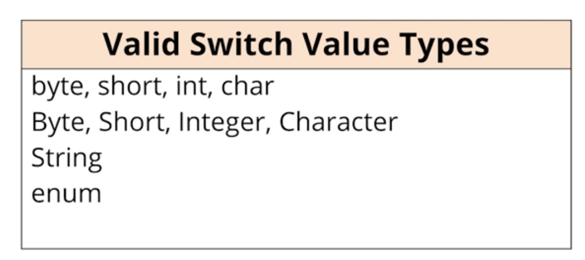

# Java 17 Masterclass: Start Coding in 2024

[Course link](https://www.udemy.com/course/java-the-complete-java-developer-course/learn/lecture/34997018#overview)

## LTS

LTS versions receive long term support from oracle and the community and are the recommended versions for important projects.

## Basic syntax and variables

### print

    Sytem.out.print("Hello world")

### Keywords

[Here](https://docs.oracle.com/javase/tutorial/java/nutsandbolts/_keywords.html)'s a list of th reserved keywords.

### Variables

To define a variable in java you have to specify its datatype, name and optionally an initial value.

    int randomNumber = 10;

You can declare multiple variables of the same type in the same statement

    int randomNumber = 10, randomNumber2=20;

### Scope

In Java variables are block scoped

### Primitive types

    Whole number
        byte
        short
        int (Integer) default
        long
    
    Real (floating point number)
        float 
        double default
    
    Single character
        char (Character)(uses single quotes)

    Boolean
        boolean

You can add the L suffix to an integer to extend it to long if the range is exceeds the Integer.MAX_VALUE.

### String

    string (uses double quotes)
    String example = "Text";

### Wrapper classes

Wrapper classes provide simple operations and basic information about the primitive data type, nost of them are just the name of the primitive type starting with an uppercase.

    Integer.MAX_VALUE

### Casting

To perform type casting you can use the desired type surounded with parenthesis

    x = (int) 2.5;

## [Operators](https://docs.oracle.com/javase/tutorial/java/nutsandbolts/opsummary.html)

### Precedence

You can check [this](https://www.cs.bilkent.edu.tr/~guvenir/courses/CS101/op_precedence.html) article to know more about Java operator precedence.

## Control Structures

### If else statement

    if(expression){

    }else if(expression){

    }else {

    }

### Ternary operator

To do a simplified if fyou can use the ternay operator

    (condition) ? ifTrue : ifFalse;

### Switch statement

    switch (variable){
        case x:
            //do  something
            break;
        
        case y:
            //do  something
            break;

        case a: case b: case c:
            //do  something
            break;

        default:
            //do  something
    }

Switch statement can only handle these types of data

## Functions - Methods

Methods in Java cannot exist outside of a class to define a method

    class ExampleClass{
        public static void ExampleMethod(int x){

        }
    }

Java does not support default values for parameters.

You can have mutliple methods with the same name inside of the same class as long as they have different parameters, so when the method is called Java assigns it to the proper handler, this is called method overloading.

You can use method overloading to help you set default paramters for a method, create a new method that handles the same task but with the missing parameters with a default variable.

    class ExampleClassSumThreenumbers{
        public static int originalMethodSumOfThree(int x, int y, int z){

        }

        public static int originalMethodSumOfThree(int x, int y){//overloaded method
            int z=5;//default value for z

            return x+y+z;
        }
    }

## Loops and iterations

### For loop

    for(start expression;condition;increment){
        //do something
    }

### while loop

    int i=0;
    while(i=0){
        //do something
    }

### do while loop

    int i=0;
    do{
        //do something
    }while(i=0);

## Exception handling

You can handle exception with the use of the try catch blocks

    try{
        //do something
    }catch(Exception e){
        //do something if an error happens
    }

## OOP

    class Example{
        //accessModifier{private, public, protected} type propertyName
        public string description;
        private double amount;
    }

### Static field

A static field has its value stored in a special memory location and is only in one place. Static methods can be invoked without a class instance.

### Instance field

Has no value until the object is created. Has a different memory location for each class instance. You need to create a class instace to be able to use non static methods